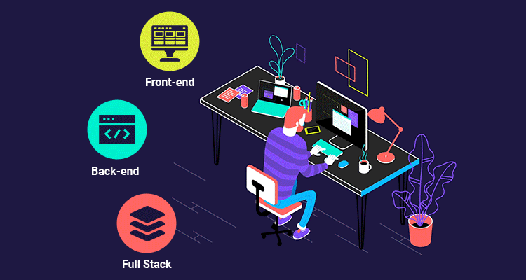

<h1 align="center">Hi 👋, I'm Behrooz Mohamadi</h1>
<h3 align="center">A passionate Fullstack Developer</h3>

  

---

- 🔭 I’m currently working on [Extratik](https://extratik.com)  
- 🌱 I’m currently learning **DevOps**  
- 💬 Ask me about **Java, PL/SQL, .NET, jQuery, Angular, Android, Docker, Elasticsearch**  
- 📫 How to reach me: **behrooz.mohamadi.66@gmail.com**  
- ⚡ Fun fact: **I am funny**

---

### 🔗 Connect with me:

  
  

---

### 🧰 Languages and Tools:

  
  
  
  
  
  
  
  
  
  
  
  
  

---

### 📊 GitHub Stats:

  

  

  

---

### 📈 Activity Graph:

[Behrooz's GitHub activity graph](https://github.com/bm-vip)
